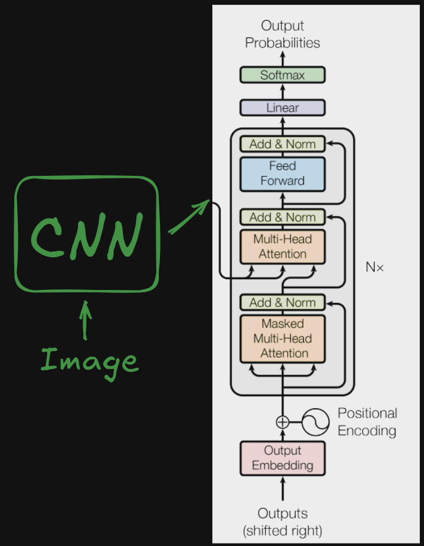

# Image Captioning Transformer

> CNN Encoder + Transformer Decoder for automatic image captioning

## Architecture

**EfficientNet-B0** → **Feature Projection** → **Transformer Decoder** → **Caption**

```
Image → CNN Features → Transformer → Text Tokens
```

## Stack

- **Vision**: EfficientNet-B0 (frozen)
- **Language**: Transformer Decoder (6 layers, 16 heads)
- **Dataset**: Flickr8k
- **Framework**: PyTorch + Timm

## Config

| Parameter       | Value     |
| --------------- | --------- |
| Context Length  | 20 tokens |
| Model Dim       | 512       |
| Blocks          | 6         |
| Attention Heads | 16        |
| Dropout         | 0.5       |

## Training

- **Optimizer**: AdamW (lr=1e-5)
- **Loss**: CrossEntropyLoss
- **Hardware**: Google Colab T4
- **Batch Size**: 32 (training) | 1 (testing)
- **Epochs**: 20

## Paper

- **[Attention Is All You Need]**
- Core transformer decoder architecture with multi-head self-attention and positional encoding used for sequence generation

## Future Improvements

- **Beam Search**: Replace greedy decoding for better caption quality
- **BLEU/ROUGE Metrics**: Add evaluation metrics for caption quality assessment
- **Variable Length**: Remove fixed 20-token constraint with dynamic padding
- **Larger Backbones**: Experiment with ViT, CLIP, or larger EfficientNet variants
- **Cross-Attention**: Add visual attention mechanism between image and text
- **Fine-tuning**: Unfreeze CNN layers for end-to-end training
- **Multi-Modal**: Integrate with CLIP embeddings for better vision-language alignment

# High Level Architecture


